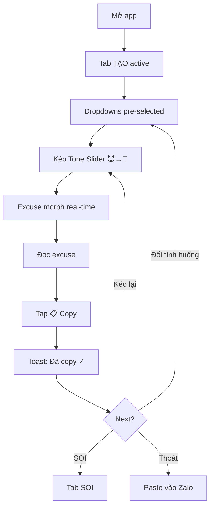
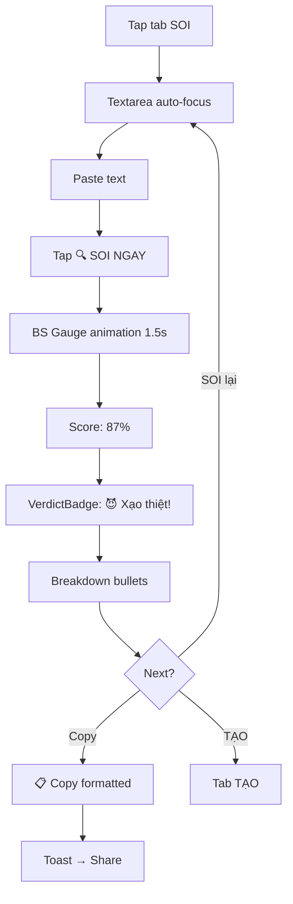
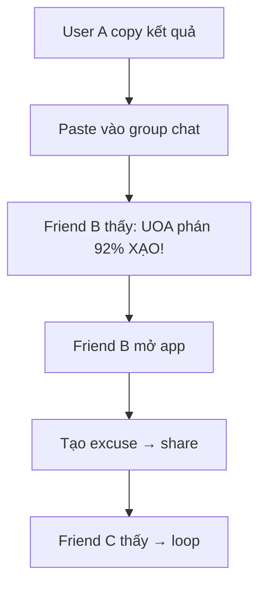

# UX Design Specification — UOA (Ú Òa)

**Author:** Uoa
**Date:** 2026-03-08

---

## Executive Summary

### Project Vision

**UOA (Ú Òa)** — entertainment web app biến "nghĩ lý do" thành trải nghiệm vui vẻ. Core loop = **TẠO** (sinh excuse) + **SOI** (detect BS). UX phải deliver cảm xúc "cười rồi share" trong 15 giây đầu.

### Target Users

| Persona | Tuổi | Context | Motivation | Device |
|---|---|---|---|---|
| **Linh** (Primary) | 21, SV | Cần excuse nhanh | Tiện lợi + vui | Mobile Chrome |
| **Minh** (Primary) | 26, VP | Soi tin nhắn đồng nghiệp | Tò mò + giải trí | Mobile + Desktop |
| **Trang** (Secondary) | 24, Creator | Tạo content TikTok | Screenshot-worthy output | Mobile |
| **Khoa** (Secondary) | 23, Student | Bị cancel phút chót | SOI nhanh + share nhóm | Mobile |

**Common traits:** Gen Z/Millennial VN, mobile-first, attention span <10 giây, quen Zalo/TikTok UX.

### Key Design Challenges

1. **Tone Slider UX** — Interaction pattern mới, chưa có tiền lệ. User phải hiểu ngay mà không cần tutorial. Emoji morphing phải feel visceral.
2. **BS Score Reveal** — Speedometer gauge phải tạo suspense + satisfaction. Khoảnh khắc "quay kim → dừng" quyết định cảm xúc.
3. **5-Second Flow** — TẠO: mở app → copy result ≤5 giây. Mọi friction = user bounce.
4. **Screenshot-Worthy Output** — Kết quả SOI phải đẹp đến mức user muốn screenshot + share ngay.

### Design Opportunities

1. **Micro-animations = Personality** — CSS animations trên Tone Slider, BS Gauge, verdict badge → app "sống" và có cá tính
2. **Dark Theme + Glassmorphism** — Premium feel cho free app → exceed expectations → retention
3. **Shareable Output Design** — Format kết quả SOI tối ưu cho paste vào Zalo/messenger → viral potential
4. **Progressive Disclosure** — Tab-based navigation (TẠO/SOI) giữ UI đơn giản

## Core User Experience

### Defining Experience

**Core Action #1 — TẠO:** Chọn tình huống → Chọn đối tượng → Kéo Tone Slider → Đọc excuse → Copy. **5 giây, 4 tap, 1 drag.**

**Core Action #2 — SOI:** Paste text → Đợi gauge animation → Đọc verdict + breakdown → Copy share text. **10 giây, 2 tap.**

**The ONE interaction:** Kéo Tone Slider xem excuse morph real-time = aha moment + cười.

### Platform Strategy

| Attribute | Decision |
|---|---|
| **Platform** | Mobile-first responsive web (SPA) |
| **Primary Input** | Touch (drag slider, tap buttons) |
| **Secondary Input** | Keyboard (paste text SOI) |
| **Offline** | Core features work sau initial load |
| **Viewport** | Optimized 375–414px, supported đến 2560px |

### Effortless Interactions

| Interaction | Target | How |
|---|---|---|
| Tạo excuse | ≤5 giây | Defaults thông minh, tình huống phổ biến pre-selected |
| Copy result | 1 tap | Button lớn, toast "Đã copy ✓" |
| Switch TẠO↔SOI | 1 tap | Tab bar cố định, không page reload |
| SOI input | 1 paste | Textarea auto-focus, placeholder hướng dẫn |
| Share kết quả | 1 tap | Pre-formatted text, copy + toast |

### Critical Success Moments

1. **😂 "Cười lần đầu"** — Đọc excuse bật cười. Template quality = critical.
2. **🎚️ "Kéo thử slider"** — Emoji morph + excuse thay đổi real-time. Animation responsiveness = critical.
3. **📊 "Gauge quay"** — BS Score animation build suspense → dramatic reveal = critical.
4. **📋 "Copy xong paste"** — Copy → paste Zalo → bạn bè phản ứng. One-tap copy + clean format = critical.

### Experience Principles

| # | Principle | Meaning |
|---|---|---|
| 1 | **Fun First, Function Second** | Mọi interaction gây cười trước, hữu ích sau |
| 2 | **Zero Learning Curve** | Dùng được ngay, 0 tutorial, 0 onboarding |
| 3 | **Share-Ready Output** | Mọi kết quả tối ưu cho copy + paste messenger |
| 4 | **Animation = Emotion** | Micro-animations LÀ trải nghiệm, không phải trang trí |
| 5 | **Mobile-Native Feel** | Touch gestures, haptic-quality animations, full-bleed dark UI |

## Desired Emotional Response

### Primary Emotional Goals

| Moment | Target Emotion | Biểu hiện |
|---|---|---|
| Mở app lần đầu | **"Ê cái này cool"** 😎 | Dark UI + animations → premium feel |
| Đọc excuse đầu tiên | **"Cười vỡ bụng"** 🤣 | Templates đúng context VN → relatable |
| Kéo Tone Slider | **"Muốn kéo thêm"** 🤩 | Emoji morph + excuse thay đổi → addictive |
| BS Score reveal | **"Ủa trùng thiệt"** 😱 | Gauge suspense → surprise → satisfied |
| Share kết quả | **"Phải cho nhóm xem"** 📱 | Proud moment → social validation |

### Emotional Journey Mapping

```
Mở app → 😎 Impressed (dark UI, premium feel)
  ↓
Chọn TẠO → 🤔 Curious (tình huống nào nhỉ?)
  ↓
Kéo Slider → 🤩 Delighted (excuse morph magic!)
  ↓
Đọc kết quả → 🤣 Amused (cười không kìm được)
  ↓
Copy → 😏 Mischievous (hehe gửi cho ai đây)
  ↓
SOI → 🧐 Investigative (soi thử xem)
  ↓
BS Reveal → 😱 Surprised → 🤣 Amused (trùng thiệt!)
  ↓
Share → 😈 Playfully Evil (tag bạn = chaos)
```

### Micro-Emotions

| Trạng thái | Target | Anti-target |
|---|---|---|
| Confidence vs Confusion | ✅ Tự tin dùng ngay | ❌ "Cái này làm gì?" |
| Excitement vs Anxiety | ✅ Háo hức thử | ❌ Lo mất data |
| Delight vs Satisfaction | ✅ Bất ngờ thú vị | ❌ "OK thôi" |
| Accomplishment vs Frustration | ✅ "Quá dễ!" | ❌ "Sao phức tạp?" |

### Design Implications

| Emotion | UX Decision |
|---|---|
| 😎 Impressed | Dark theme + glassmorphism + smooth animations ngay load |
| 🤣 Amused | Templates chất, đọc lên buồn cười |
| 🤩 Addicted | Tone Slider responsive <16ms, emoji transition fluid |
| 😱 Surprised | BS Gauge: delay 1.5s → spin → dramatic stop |
| 😈 Mischievous | Share format provocative: "🔍 UOA phán: 92% XẠO!" |
| 😏 Confident | Copy toast ngay, no error states visible |

### Emotional Design Principles

1. **Surprise > Satisfaction** — Bất ngờ thú vị tốt hơn "OK đúng rồi". Output phải unpredictable.
2. **Tension → Release** — BS Gauge tạo suspense rồi reveal. Không reveal ngay lập tức.
3. **Social Proof Loop** — Share → react → validated → share thêm.
4. **Mischief Factor** — App cảm thấy như "bí mật thú vị" — không phải tool nghiêm túc.

## UX Pattern Analysis & Inspiration

### Inspiring Products Analysis

| App | Tại sao users yêu | UX Pattern chính |
|---|---|---|
| **TikTok** | Scroll vô tận, share dễ | Full-screen immersive, 1-tap share |
| **Zalo** | Nhắn tin nhanh, copy dễ | Long-press menu, quick copy |
| **Wordle** | Simple + addictive, share grid = viral | Visual result = shareable, tension → reveal |
| **Tinder** | Swipe satisfying, instant feedback | Gesture = decision, animation feedback |

### Transferable UX Patterns

**Navigation:** TikTok tab bar → UOA tab bar (TẠO/SOI) — bottom-fixed, instant switch. Wordle single-screen → mỗi tab = 1 screen.

**Interaction:** Tinder swipe → Tone Slider drag (weight + snap). Wordle reveal → BS Gauge suspense. TikTok 1-tap share → Copy button luôn visible.

**Visual:** TikTok dark mode → UOA dark default. Wordle color-coded → BS verdict badge mỗi mức có color + emoji riêng.

**Engagement:** Wordle share pattern → SOI result share text-based, platform-agnostic.

### Anti-Patterns to Avoid

| Anti-Pattern | Thay thế bằng |
|---|---|
| Onboarding screens | Zero onboarding: UI tự giải thích |
| Login wall | No login, instant access |
| Loading spinners | Client-side instant, animation distraction |
| Generic UI (Material/Bootstrap) | Custom dark theme + glassmorphism |
| Share modal phức tạp | 1 nút Copy, formatted text sẵn |

### Design Inspiration Strategy

**Adopt:** TikTok tab bar, Wordle share-as-text, dark theme default.
**Adapt:** Tinder swipe → Tone Slider drag, Wordle reveal → BS Gauge.
**Avoid:** Auth, multi-step flows, share dialogs.

## Design System Foundation

### Design System Choice

**Custom Design System (Vanilla CSS + CSS Custom Properties)** — Không dùng framework UI. Toàn bộ styling tự viết.

### Rationale for Selection

| Factor | Decision |
|---|---|
| **Uniqueness** | Dark glassmorphism cần visual identity riêng |
| **Performance** | Zero-dep = <50KB CSS |
| **Zero-cost** | Không CDN dependency |
| **Animations** | Custom CSS animations cho Tone Slider + BS Gauge |
| **Team** | Solo dev — không cần docs team |

### Implementation Approach

**Design Tokens (CSS Custom Properties):**
```css
:root {
  --bg-primary: #0a0a0f;
  --bg-card: rgba(255, 255, 255, 0.05);
  --accent-primary: #7c3aed;
  --accent-glow: rgba(124, 58, 237, 0.3);
  --text-primary: #f0f0f0;
  --text-secondary: #a0a0a0;
  --glass-bg: rgba(255, 255, 255, 0.08);
  --glass-border: rgba(255, 255, 255, 0.12);
  --glass-blur: 16px;
  --ease-bounce: cubic-bezier(0.68, -0.55, 0.265, 1.55);
  --ease-smooth: cubic-bezier(0.4, 0, 0.2, 1);
  --duration-fast: 150ms;
  --duration-normal: 300ms;
  --duration-dramatic: 1500ms;
  --radius-sm: 8px;
  --radius-md: 12px;
  --radius-lg: 20px;
  --radius-pill: 999px;
}
```

### Customization Strategy

**Component Library (tự build):**

| Component | Priority | Complexity |
|---|---|---|
| `TabBar` | P0 | Low |
| `ToneSlider` | P0 | High |
| `BSGauge` | P0 | High |
| `GlassCard` | P0 | Low |
| `CopyButton` | P0 | Low |
| `Toast` | P0 | Low |
| `VerdictBadge` | P1 | Medium |
| `Dropdown` | P1 | Medium |

**Typography:** Google Fonts — `Inter` (body) + `Space Grotesk` (headings, numbers).

## Defining Experience Detail

### The Defining Experience

**UOA: "Kéo slider xem excuse biến đổi"** — Tone Slider định nghĩa UOA như swipe định nghĩa Tinder.

### User Mental Model

| Mental Model | UOA Maps To |
|---|---|
| Volume knob | Kéo = tăng/giảm "mức bịa" |
| Emoji reaction picker | Emoji trên thumb = visual clue tone |
| Text generator | Nhập context → ra text (instant, không chờ) |

### Success Criteria

| Criteria | Measurement |
|---|---|
| Instant morphing | Excuse thay đổi <100ms khi kéo |
| Cười | User cười khi đọc (template quality) |
| Copy ngay | Copy result ≤2s sau khi đọc |
| Kéo lại | User kéo slider ≥2 lần (addictive) |
| Share | ≥40% user share result lần đầu |

### Novel UX Patterns

| Pattern | Status | Education |
|---|---|---|
| **Tone Slider** | 🆕 Novel | Emoji thumb = self-documenting. "Kéo thử!" |
| **BS Gauge** | 🆕 Novel (familiar metaphor) | Speedometer = ai cũng hiểu |
| **Tab TẠO/SOI** | ✅ Established | Standard tab bar |
| **Copy button** | ✅ Established | Toast feedback |

### Experience Mechanics — TẠO Flow

```
1. INITIATION: App mở → Tab TẠO active
   → Dropdown: tình huống (pre-selected phổ biến)
   → Dropdown: đối tượng (pre-selected "Sếp")

2. INTERACTION: Kéo Tone Slider
   → Thumb emoji: 😇 → 😊 → 😏 → 😈 → 🐍
   → Excuse morph real-time trong GlassCard

3. FEEDBACK: Text highlight animation khi thay đổi
   → Emoji bounce khi snap level mới

4. COMPLETION: Tap "📋 Copy" → Toast "Đã copy ✓"
```

### Experience Mechanics — SOI Flow

```
1. INITIATION: Tap tab "SOI"
   → Textarea auto-focus, placeholder "Paste lý do..."

2. INTERACTION: Paste text → Tap "🔍 SOI"
   → BS Gauge quay 1.5s, kim tăng dần

3. FEEDBACK: Gauge dừng → Score hiện (e.g. "87%")
   → VerdictBadge: "🐍 Bịa cứng!" (color-coded)
   → Breakdown 3-4 bullet

4. COMPLETION: Tap "📋 Copy kết quả"
   → "🔍 UOA phán: 87% XẠO! 🐍" → Toast
```

## Visual Design Foundation

### Color System

**Primary Palette (Dark Theme):**

| Token | Value | Usage |
|---|---|---|
| `--bg-primary` | `#0a0a0f` | Main background |
| `--bg-secondary` | `#12121a` | Card backgrounds |
| `--bg-elevated` | `#1a1a2e` | Modal, dropdown |
| `--accent-primary` | `#7c3aed` | CTA, Tone Slider track |
| `--accent-secondary` | `#06b6d4` | Secondary accents |
| `--accent-glow` | `rgba(124, 58, 237, 0.3)` | Glow effects |

**Semantic Colors:**

| Token | Value | Usage |
|---|---|---|
| `--success` | `#10b981` | Low BS, copy toast |
| `--warning` | `#f59e0b` | Medium BS (40-69%) |
| `--danger` | `#ef4444` | High BS (70-89%) |
| `--critical` | `#dc2626` | Critical BS (90%+) |
| `--text-primary` | `#f0f0f0` | Main text |
| `--text-secondary` | `#a0a0a0` | Muted labels |
| `--text-muted` | `#6b7280` | Placeholders |

**Glassmorphism:** `--glass-bg: rgba(255,255,255,0.08)`, `--glass-border: rgba(255,255,255,0.12)`, `--glass-blur: 16px`

**BS Score Color Scale:**

| Range | Color | Emoji | Label |
|---|---|---|---|
| 0-29% | 🟢 `--success` | � | "Thật thà" |
| 30-49% | 🔵 `--accent-secondary` | 😊 | "Hơi màu" |
| 50-69% | 🟡 `--warning` | 😏 | "Có mùi" |
| 70-89% | 🔴 `--danger` | 😈 | "Xạo thiệt" |
| 90-100% | 🔴🔴 `--critical` | �🐍 | "Bịa cứng!" |

### Typography System

| Role | Font | Weight | Size |
|---|---|---|---|
| Display (BS Score %) | `Space Grotesk` | 700 | 48px |
| H1 (Tab title) | `Space Grotesk` | 600 | 28px |
| H2 (Section) | `Inter` | 600 | 20px |
| Body (Excuse text) | `Inter` | 400 | 16px |
| Label (Buttons) | `Inter` | 500 | 14px |
| Caption | `Inter` | 400 | 12px |

### Spacing & Layout Foundation

**Scale (4px base):** `4 → 8 → 12 → 16 → 24 → 32 → 48 → 64`

**Layout:** Single column, max-width `480px` centered. Content padding `16px`. Tab bar `56px` fixed bottom. Safe area `env(safe-area-inset-bottom)`.

### Accessibility

| Requirement | Implementation |
|---|---|
| Color contrast WCAG AA | `#f0f0f0` on `#0a0a0f` = 18.4:1 ✅ |
| Touch targets ≥44px | All buttons ≥48px ✅ |
| Focus indicators | `--accent-glow` outline ✅ |
| `prefers-reduced-motion` | Disable animations ✅ |
| Min font size 16px | Base 16px ✅ |

## Design Direction Decision

### Directions Explored

6 directions generated in `ux-design-directions.html`: Glassmorphism, Neon Cyber, Minimal, SOI View, Slider Focus, Full Flow.

### Chosen Direction: D2 + D4 + D5 Hybrid

| Element | Source | Application |
|---|---|---|
| **Color & Vibe** | D2 Neon Cyber | Gradient accents (`#7c3aed` → `#06b6d4`), pulsing glow, bold palette |
| **SOI Tab** | D4 SOI View | BS Gauge speedometer, color-coded verdict badge, breakdown bullets |
| **Slider** | D5 Slider Focus | Giant emoji hero, slider as dominant element, touch-first |

### Design Rationale

- **D2 Neon Cyber:** Edgy, expressive — phù hợp Gen Z VN, memorable visual identity
- **D4 SOI View:** Dramatic BS Gauge reveal tạo suspense → surprise → amusement
- **D5 Slider Focus:** Slider là hero element — đúng với defining experience "kéo slider xem excuse biến đổi"

### Implementation Approach

- Gradient CTA buttons + pulsing glow effects (D2)
- Radial gradient backgrounds + animated pulse overlays (D2)
- Emoji `font-size: 64px` hero display with bounce animation (D5)
- SVG speedometer gauge with conic-gradient + needle animation (D4)
- Verdict badge: `border-radius: pill`, color-coded per BS range (D4)

## User Journey Flows

### Journey 1: TẠO Excuse (~5s)



**Happy path:** 5 taps, ~5 giây. **Edge cases:** Offline → local templates ✅. Pre-selected defaults → zero-config ✅.

### Journey 2: SOI (~10s)



**Happy path:** 3 taps + paste, ~10 giây. **Edge cases:** <10 chars → hint. >500 chars → truncate. Empty → button disabled.

### Journey 3: Viral Loop



### Journey Patterns

| Pattern | Implementation |
|---|---|
| Pre-selected defaults | Zero-config start |
| 1-tap action | Copy/SOI = immediate feedback |
| Toast confirmation | Slide-up 2s auto-dismiss |
| Tab persistence | State preserved khi switch |

### Flow Optimization

1. **Zero-config:** Defaults sẵn → user chỉ cần kéo slider
2. **No dead ends:** Mọi screen có action tiếp theo
3. **Error prevention > handling:** Disable buttons thay vì show errors

## Component Strategy

### Custom Components (Full Custom — No Framework)

#### `TabBar`
- **Anatomy:** 2 buttons fixed bottom, icon + label
- **States:** Active (gradient bg + glow) / Inactive (muted)
- **A11y:** `role="tablist"`, `aria-selected`, keyboard ←→

#### `ToneSlider` ⭐
- **Anatomy:** Gradient track + circle thumb (emoji) + hero emoji display (64px)
- **5 Levels:** `0:😇` `1:😊` `2:😏` `3:😈` `4:🐍`
- **States:** Default → Dragging (scale 1.2x, glow) → Snapped (bounce)
- **Behavior:** Drag + snap, excuse morph <100ms
- **A11y:** `role="slider"`, keyboard ←→

#### `BSGauge` ⭐
- **Anatomy:** Semi-circle SVG gauge + needle + score (48px) + VerdictBadge
- **States:** Idle → Animating (1.5s spin) → Revealed (settle + score)
- **Colors:** BS Score Color Scale (🟢→🔵→🟡→🔴→🔴🔴)
- **A11y:** `aria-live="polite"`

#### `GlassCard`
- **Anatomy:** Rounded card, glass-bg, glass-border, backdrop-blur
- **Variants:** Default, Elevated, Bordered-left

#### `SituationPicker` ⚠️ (Redesigned from plain Dropdown)
- **Purpose:** Chọn tình huống / đối tượng
- **Anatomy:** Label phía trên (“Tình huống” / “Nói với”) + Pill/Chip shape button + Emoji prefix + Text + Chevron ▾ icon bên phải
- **Visual:** Glass-bg với `border: 1px solid var(--accent-primary)` + border-radius pill + padding generous `12px 16px`
- **States:** Default (glass border, chevron ▾) → Hover/Focus (accent glow ring) → Open (dropdown expand, chevron ▴) → Selected (show selected emoji + text, collapse)
- **Why redesign:** Native `<select>` không rõ ràng trên dark theme. User không nhận ra đó là menu thả xuống → cần chevron icon + accent border + label phía trên
- **Dropdown list:** Full-width overlay, glass-bg, mỗi item có emoji + text + hover highlight
- **A11y:** `role="listbox"`, `aria-expanded`, keyboard ↑↓ Enter

#### `CopyButton`
- **States:** Default → Hover (lift) → Active (press) → Success (✓ swap 1s)
- **Behavior:** `navigator.clipboard.writeText()` → Toast

#### `Toast`
- **Anatomy:** Pill, slide-up, icon + text, auto-dismiss 2s
- **A11y:** `role="status"`, `aria-live="polite"`

#### `VerdictBadge`
- **Anatomy:** Pill badge, bg tint per BS range, emoji + label
- **Variants:** 5 levels per BS Score Color Scale

### Implementation Roadmap

| Phase | Components | Cần cho |
|---|---|---|
| **P0 Core** | `TabBar`, `ToneSlider`, `GlassCard`, `CopyButton`, `Toast`, `SituationPicker` | TẠO flow |
| **P0 SOI** | `BSGauge`, `VerdictBadge` | SOI flow |

## UX Consistency Patterns

### Button Hierarchy

| Level | Style | Usage |
|---|---|---|
| **Primary** | Gradient bg (`#7c3aed`→`#06b6d4`), white text, glow | "📋 Copy", "🔍 SOI NGAY" |
| **Tab** | Glass-bg, gradient khi active | TẠO/SOI switch |
| **Picker** | Glass-bg, accent border, chevron ▾ | SituationPicker items |

Max 1 primary button per screen. Buttons ≥48px height. Hover: lift 2px. Active: press.

### Feedback Patterns

| Event | Pattern | Timing |
|---|---|---|
| Copy success | Toast "Đã copy ✓" | 300ms in, 2s visible |
| Slider snap | Emoji bounce + pulse | Instant |
| BS Gauge reveal | Spin → overshoot → settle | 1.5s |
| Tab switch | Instant swap | <100ms |
| Empty SOI | Button disabled | Continuous |

No error modals. No red error states. Prevent errors instead.

### Form Patterns

- **SituationPicker:** Label above + pill button + chevron. Pre-selected default
- **Textarea (SOI):** Auto-focus on tab switch. Placeholder text
- **Slider:** No label — emoji is self-documenting
- All inputs have defaults → user never sees empty state

### Navigation Patterns

- Tab bar fixed bottom, 2 tabs, instant switch
- Tab state preserved when switching
- No deep linking for v0.1 (SPA)
- Browser back = exit app

### Loading & Empty States

- App load: Instant (static HTML, no API)
- No loading spinners needed — everything client-side
- Empty excuse: Never happens — defaults always produce text
- Empty SOI: Textarea placeholder + disabled button

## Responsive Design & Accessibility

### Responsive Strategy

| Device | Strategy | Layout |
|---|---|---|
| **Mobile (320-767px)** 🎯 | **Primary target** — single column, full-width | Bottom tab bar, stacked pickers → slider → result |
| **Tablet (768-1023px)** | Centered card `max-width: 480px` | Same single-column, generous whitespace |
| **Desktop (1024px+)** | **Sharing landing page** — result + CTA | Không phải phone frame mockup |

**Approach:** Mobile-first CSS. Tablet = centered mobile. Desktop = sharing/marketing page khi user nhận link.

### Breakpoint Strategy

```css
/* Mobile-first (default) */
:root { --content-max: 414px; }

/* Tablet — centered card */
@media (min-width: 768px) {
  .app-container { max-width: var(--content-max); margin: 0 auto; }
}

/* Desktop — sharing landing page layout */
@media (min-width: 1024px) {
  .app-container { max-width: 600px; border-radius: 24px; }
}

/* Height fix — iOS Safari toolbar */
html { height: 100dvh; } /* fallback: window.innerHeight */
```

### Performance Fallbacks

```css
/* Android mid-range: backdrop-filter lag */
.glass-card {
  background: rgba(20, 20, 35, 0.92); /* solid fallback */
}
@supports (backdrop-filter: blur(16px)) {
  .glass-card {
    background: rgba(20, 20, 35, 0.6);
    backdrop-filter: blur(16px);
  }
}
```

- Samsung A-series / Xiaomi (~60% Gen Z VN) không support `backdrop-filter` mượt
- Dark theme only → không cần `prefers-color-scheme` CSS → save ~30% stylesheet

### Accessibility (WCAG 2.1 Level AA)

| Category | Requirement | UOA Implementation |
|---|---|---|
| **Color Contrast** | 4.5:1 normal, 3:1 large | ✅ White on dark ≈ 15:1 |
| **Touch Target** | ≥48×48px | Picker 48px, Slider thumb 44px + 64px hit area |
| **Keyboard** | Full navigation | Tab → pickers → slider → button |
| **Screen Reader** | ARIA labels | `aria-label` slider, `role="listbox"` picker |
| **Reduced Motion** | `prefers-reduced-motion` | **Fade-in thay vì spin** (không disable hoàn toàn) |
| **Font Size** | ≥16px base | ✅ 16px min — iOS Safari auto-zoom prevention |

**Reduced Motion Strategy:**
- BS Gauge: `spin → overshoot → settle` → **fade-in + number count-up**
- Slider emoji: `bounce + pulse` → **simple crossfade**
- Core delight preserved, chỉ thay animation style

### Progressive Enhancement

```js
// Haptic feedback on slider snap (Android)
slider.addEventListener('input', () => {
  navigator.vibrate?.(10);
});
```

- `navigator.vibrate` — Android only, zero-cost, tăng tactile feedback
- `visualViewport` API — handle keyboard push layout trên SOI textarea
- iOS textarea ≥16px font bắt buộc — tránh Safari auto-zoom

### Testing Strategy

| Test | Tool | Target |
|---|---|---|
| Mobile simulation | Chrome DevTools (iPhone SE → 15 Pro Max) | Layout, touch |
| Accessibility audit | Lighthouse | Score ≥95 |
| Keyboard nav | Manual | Full flow without mouse |
| Reduced motion | OS toggle | Fade alternatives work |
| Android fallback | Samsung Internet Browser | No backdrop-filter lag |
| Real device | iPhone + Samsung A-series | End-to-end |
